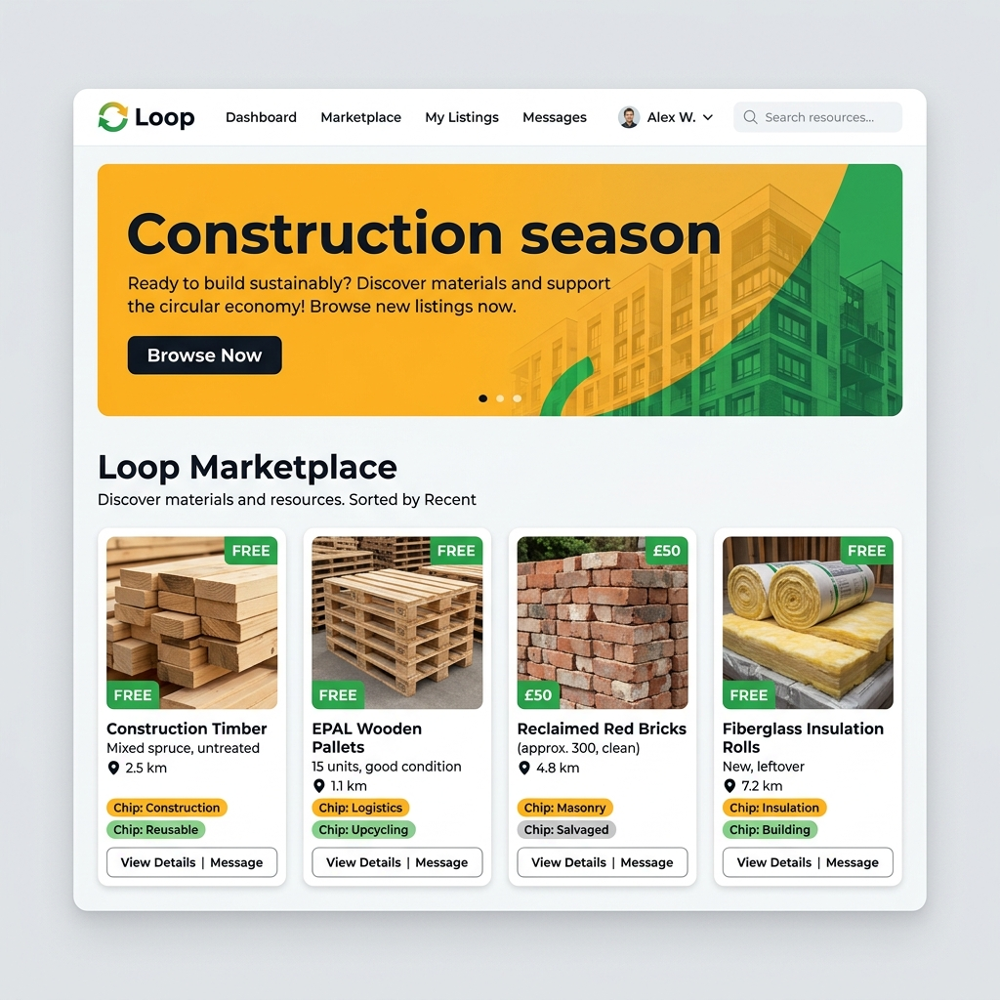

# Loop Marketplace

Loop is a circular economy marketplace built to keep usable waste materials out of landfills by matching them with buyers, makers, and upcyclers.

## Features
- **Next.js 14 App Router** + **Tailwind CSS v4** + **shadcn/ui**
- **Supabase** with PostgreSQL and PostGIS for radius-based geo-searches
- **Typesense** for full-text search
- **Stripe Connect** for escrow payments

## Getting Started

1. Clone the repository
2. Install dependencies: `npm install`
3. Run the development server: `npm run dev`

Open [http://localhost:3000](http://localhost:3000) with your browser to see the result.
